# Architecture

This system keeps diagnosis deterministic and treats the Razorpay SDK as a gated side effect after every existing recovery policy has passed.

```mermaid
flowchart LR
    S[Synthetic incident batch] --> D[Pair-level degradation detector]
    D --> C[Five-source correlator]
    C --> R[Traceable RCA]
    R --> I[GMV impact calculator]
    I --> G{Recovery policy gates}
    G -->|unresolved, over cap, unhealthy route| E[Escalate or contain]
    G -->|eligible high-intent failures| M[Payment Link decision]
    M -->|default| X[SIMULATED result]
    M -->|LIVE_API_MODE + rzp_test_ key| T[Capped and throttled Razorpay TEST MODE API]
    T --> L[Test Payment Link + local registry]
    T -->|API unavailable| X
    L --> W[Signed Razorpay webhook]
    W --> V[Raw-body signature verification + event idempotency]
    V --> A[Actual test-mode recovery reconciliation]
    E --> O[Incident record and audit trail]
    X --> O
    A --> O
    O --> F[FastAPI snapshot]
    F --> U[Summary, incident timeline, RCA and audit UI]
```

## Trust Boundaries

- Synthetic payment data never becomes an input to a production charge. The only real network side effect is creation or cancellation of Razorpay **test** Payment Links.
- `src/razorpay_integration.py` rejects key IDs without the `rzp_test_` prefix, caps each incident and process, throttles SDK calls, and falls back without terminating the pipeline.
- Secrets are loaded from `.env`, never returned by an API, and never interpolated into logs.
- Webhooks are verified against the untouched request body. Duplicate event IDs are ignored and only locally registered test links can change an incident result.
- Mode labels are part of both API records and the UI: `SIMULATED`, `LIVE TEST-MODE`, or `ACTUAL TEST-MODE`.
