# Payment Incident Investigator + Revenue Recovery Commander

**Razorpay AI Buildathon · Track: AI Revenue Recovery**

> **TEST MODE ONLY:** Optional Razorpay API calls in this project require an `rzp_test_` key and create test Payment Links only. No production payment or real money movement is performed.

Payment incidents rarely live in one tool. A success-rate alert may appear in monitoring, the causal deploy in a release log, a PSP signature in traces, and the revenue exposure only in payment data. This project joins those fragments into the Buildathon loop:

> payment degradation → root cause → recovery action

It continues through quantified business impact, a bounded action, a modeled result, and a complete audit trail. Low-confidence cases are not forced into a narrative: the agent says `unresolved` and escalates.

All incident events, payment attempts, and evaluation results are synthetic. The **35% recovery success rate is a modeling assumption**, not a measured Razorpay or real-world statistic. A verified test webhook is labeled `ACTUAL TEST-MODE`; it is still not production revenue.

## Architecture

```mermaid
flowchart LR
    A[5 disconnected synthetic streams] --> B[Pair-level detector]
    B --> C[Evidence correlator]
    C --> D[Traceable RCA]
    D --> E[GMV impact calculator]
    E --> F[Bounded recovery engine]
    F --> G[Incident JSON + audit trail]
    F -. explicit opt-in .-> R[Razorpay TEST MODE Payment Link API]
    R --> W[Verified test webhook]
    W --> G
    G --> H[FastAPI live snapshot]
    H --> I[Summary + incident replay UI]
```



```text
data/simulate.py   60 deterministic incidents: payments, deploys/config,
                   alerts, webhooks, and error traces; 15% ambiguous
src/detector.py    rolling-baseline comparison per (method, route) pair
src/correlator.py  independent evidence scoring with a 0.60 honesty gate
src/memory.py      cosine pattern recall over PRIOR incidents in the batch only
src/rca.py         human-readable RCA using only computed evidence values
src/impact.py      attempted, failed, recoverable, and modeled recovered GMV
src/recovery.py    one primary action, hard bounds, route-health gate, audit
src/pipeline.py    end-to-end record construction and evidence timeline
src/evaluate.py    full-dataset metrics, exceptions, and results.json
src/config.py      reviewable recovery policy knobs and modeling assumption
src/float_compare.py  decimal-sense comparisons for policy thresholds
src/api.py         live incident, detail, summary, simulation, and health APIs
src/run_demo.py    regenerate, evaluate, and serve the demo in one command
src/razorpay_integration.py  capped/throttled TEST MODE SDK adapter
src/cleanup_test_links.py    list or cancel links created by this demo
src/preflight_check.py       offline and live test-mode GO/NO-GO checks
ui/timeline.html   no-build summary, filters, RCA, audit, and replay UI
```

## Safety policy

The autonomous decision boundary is code, not prompt text:

- `MIN_CONFIDENCE_FOR_AUTO_ACTION = 0.60`; lower confidence escalates with no autonomous recovery action.
- `MAX_AUTO_RETRY_AMOUNT_INR = 50_000` per payment.
- `MAX_RETRIES_PER_PAYMENT = 2`.
- Route-level incidents require an explicit passing route-health confirmation before retry. Missing confirmation is not treated as healthy.
- Merchant notification requires failed-GMV exposure of at least `INR 100,000` (configurable constant).
- Every action, suppression, and escalation records `{incident_id, action, reason, bounded_by, timestamp}`.
- Real calls require `LIVE_API_MODE=true` or `--live-api`, reject non-`rzp_test_` keys, create at most 3 links per incident and 3 per demo process, and are throttled to one call per second.

## One-command demo

Python 3.10+ is required. Set up the isolated environment once:

```bash
python3 -m venv .venv
.venv/bin/python -m pip install -r requirements.txt
```

Then boot the entire pitch demo with one command:

```bash
.venv/bin/python -m src.run_demo
```

Open `http://127.0.0.1:8000/`. The launcher regenerates the deterministic dataset, evaluates every incident, starts FastAPI, and serves the UI from the same process. The UI reads live API data rather than `results.json` directly.

Run the judge-facing safety properties with:

```bash
.venv/bin/pytest -q
```

Run the morning-of checklist with:

```bash
.venv/bin/python -m src.preflight_check
```

The offline dashboard remains the default and works without Razorpay credentials or network access.

## Live Demo Mode

1. In the Razorpay Dashboard, switch to **Test Mode** and create a Key ID and Key Secret under Settings > API Keys. The Key ID must begin with `rzp_test_`.
2. Create `.env` from `.env.example` and set `RAZORPAY_KEY_ID`, `RAZORPAY_KEY_SECRET`, and a separately configured `RAZORPAY_WEBHOOK_SECRET`. `.env` is ignored by Git. Never commit or paste the secret into logs.
3. Verify the credentials and harmless Payment Link list call:

```bash
.venv/bin/python -m src.preflight_check --require-live
```

4. Start the capped integration explicitly:

```bash
.venv/bin/python -m src.run_demo --live-api
```

`LIVE_API_MODE=true .venv/bin/python -m src.run_demo` is equivalent. The SDK only creates a sample of eligible test Payment Links, with a 30-minute expiry, no customer notification, a three-create-attempt per-process budget, and one-call-per-second throttling. Failed calls consume the budget, so an outage cannot produce an unbounded retry loop. API failure or missing configuration falls back to the existing simulated recovery and adds that fact to the audit trail.

For verified webhooks, configure the public endpoint as:

```text
POST https://YOUR_PUBLIC_HOST/api/webhooks/razorpay
```

The commonly used local command is:

```bash
ngrok http 8000
```

However, Razorpay's current webhook documentation lists `ngrok.io` among blocked domains. For the pitch, use a public staging hostname or a supported tunnel such as zrok, then register that HTTPS URL in the Razorpay **Test Mode** webhook settings. Subscribe to `payment.captured`, `payment.failed`, and `payment_link.paid`, and use the same webhook secret in `.env`.

After the demo, review and cancel registered test links:

```bash
.venv/bin/python -m src.cleanup_test_links
.venv/bin/python -m src.cleanup_test_links --execute
```

The first command is a dry run. Cleanup only operates on link IDs stored by this project and still enforces the `rzp_test_` credential gate.

## Live API

| Endpoint | Purpose |
|---|---|
| `GET /api/health` | Readiness and loaded incident count |
| `GET /api/summary` | Detection and aggregate GMV metrics |
| `GET /api/incidents` | Lightweight searchable incident index |
| `GET /api/incidents/{id}` | Full RCA, evidence, GMV, timeline, and audit record |
| `POST /api/simulate` | Atomically regenerate and evaluate a fresh batch |
| `POST /api/webhooks/razorpay` | Verify and reconcile Razorpay test-mode recovery events |

Simulation inputs are validated to 10–200 incidents and an ambiguous ratio from 0.0–0.5. Omit `seed` for a fresh batch or provide one for reproducibility:

```bash
curl -X POST http://127.0.0.1:8000/api/simulate \
  -H 'content-type: application/json' \
  -d '{"incident_count":60,"ambiguous_ratio":0.15}'
```

## Full-run results

These values come from the checked-in deterministic run of all 60 incidents (51 clear, 9 deliberately ambiguous):

| Metric | Full-dataset result |
|---|---:|
| Pair-level detection accuracy | 100.0% |
| Root-cause accuracy on clear cases | 100.0% |
| Honesty rate on ambiguous cases | 100.0% |
| Attempted GMV | INR 155,581,716 |
| Failed GMV | INR 21,108,516 |
| Recoverable GMV | INR 6,787,322 |
| Modeled recovered amount | INR 2,375,563 |
| Recovery-rate basis | **35% modeling assumption; not measured** |
| Incident escalations | 9 |
| Misdiagnoses | 0 |

Nothing is cherry-picked. Generated `results.json` contains all 60 pipeline records, their evidence and audit trails, plus the complete exception list. It is ignored by Git and regenerated on every demo boot.

The previously documented miss (INC-0045, 98.3% detection / 1 misdiagnosis) was a floating-point defect, not a tuning choice. Its true success-rate drop is exactly `0.05`, but `0.97 - 0.92` evaluates to `0.04999999999999993` in binary floating point, so it fell a few ULPs under a `>= 0.05` gate and was rejected. Threshold comparisons now go through `src/float_compare.py`, which compares in decimal terms. See `tests/test_float_precision.py`.

## Sample RCA output

> At 00:00 UTC, UPI Collect failures rose 23.0%. 89.3% came from PSP abc@upi. Merchant deploy overlap: merchant-checkout v8.14.1 at 2026-08-19T23:58:00Z (100% rollout). Razorpay routing config unchanged. Likely merchant deploy regression (confidence 0.95).

> At 00:37 UTC, UPI Intent failures rose 29.0%. 91.2% came from PSP swift@upi. No merchant deploy overlap. Razorpay routing config unchanged. Likely external PSP/bank degradation (confidence 0.85).

> At 03:05 UTC, UPI Intent failures rose 32.0%. 91.9% came from PSP swift@upi. No merchant deploy overlap. Razorpay routing config unchanged. Signals inconclusive - escalating for manual review.

Every percentage, route, timestamp, amount, and confidence value in these strings is derived from the corresponding generated incident record.

## Output contract

Each incident in generated `results.json` includes detection details, correlation evidence and scoring, RCA text, the four exact GMV fields, the selected recovery action, timeline markers, and the full audit trail. By default, `recovered_amount_inr` is `recoverable_gmv_inr × 0.35` and explicitly labeled as modeled. A verified Razorpay test webhook preserves that estimate as `modeled_recovered_amount_inr`, replaces the displayed value with the test event amount, and labels it `ACTUAL TEST-MODE`.
