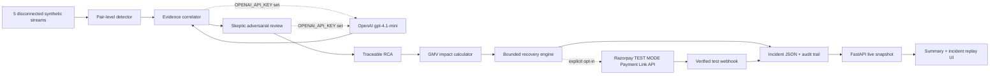

# Payment Incident Investigator + Revenue Recovery Commander

**Razorpay AI Buildathon · Track: AI Revenue Recovery**

> **TEST MODE ONLY:** Optional Razorpay API calls in this project require an `rzp_test_` key and create test Payment Links only. No production payment or real money movement is performed.

Payment incidents rarely live in one tool. A success-rate alert may appear in monitoring, the causal deploy in a release log, a PSP signature in traces, and the revenue exposure only in payment data. This project joins those fragments into the Buildathon loop:

> payment degradation → root cause → recovery action

It continues through quantified business impact, a bounded action, a modeled result, and a complete audit trail. Low-confidence cases are not forced into a narrative: the agent says `unresolved` and escalates.

All incident events, payment attempts, and evaluation results are synthetic. The **35% recovery success rate is a modeling assumption**, not a measured Razorpay or real-world statistic. A verified test webhook is labeled `ACTUAL TEST-MODE`; it is still not production revenue.

## Architecture



```text
data/simulate.py   60 deterministic incidents: payments, deploys/config,
                   alerts, webhooks, and error traces; 15% ambiguous
src/detector.py    rolling-baseline comparison per (method, route) pair
src/correlator.py  LLM or rule-based root-cause diagnosis with a 0.60 honesty gate
src/memory.py      cosine pattern recall over PRIOR incidents in the batch only
src/rca.py         human-readable RCA using only computed evidence values
src/impact.py      attempted, failed, recoverable, retry-recovered, and GMV-protected calculations
src/recovery.py    one primary action, hard bounds, route-health gate, audit
src/pipeline.py    end-to-end record construction and evidence timeline
src/evaluate.py    full-dataset metrics, exceptions, and results.json
src/config.py      reviewable recovery policy knobs and modeling assumption
src/llm.py         shared OpenAI client, structured JSON calls, usage tracking
src/float_compare.py  decimal-sense comparisons for policy thresholds
src/api.py         live incident, detail, summary, simulation, and health APIs
src/run_demo.py    regenerate, evaluate, and serve the demo in one command
src/razorpay_integration.py  capped/throttled TEST MODE SDK adapter
src/cleanup_test_links.py    list or cancel links created by this demo
src/preflight_check.py       offline and live test-mode GO/NO-GO checks
ui/timeline.html   no-build summary, filters, RCA, audit, and replay UI
```

## Safety policy

The autonomous decision boundary is code, not prompt text:

- `MIN_CONFIDENCE_FOR_AUTO_ACTION = 0.60`; lower confidence escalates with no autonomous recovery action.
- `MAX_AUTO_RETRY_AMOUNT_INR = 50_000` per payment.
- `MAX_RETRIES_PER_PAYMENT = 2`.
- Route-level incidents require an explicit passing route-health confirmation before retry. Missing confirmation is not treated as healthy.
- Merchant notification requires failed-GMV exposure of at least `INR 100,000` (configurable constant).
- Every action, suppression, and escalation records `{incident_id, action, reason, bounded_by, timestamp}`.
- Real calls require `LIVE_API_MODE=true` or `--live-api`, reject non-`rzp_test_` keys, create at most 3 links per incident and 3 per demo process, and are throttled to one call per second.

## One-command demo

Python 3.10+ is required. Set up the isolated environment once:

```bash
python3 -m venv .venv
.venv/bin/python -m pip install -r requirements.txt
```

Then boot the entire pitch demo with one command:

```bash
.venv/bin/python -m src.run_demo
```

Open `http://127.0.0.1:8000/`. The launcher regenerates the deterministic dataset, evaluates every incident, starts FastAPI, and serves the UI from the same process. The UI reads live API data rather than `results.json` directly.

Run the judge-facing safety properties with:

```bash
.venv/bin/pytest -q
```

Run the morning-of checklist with:

```bash
.venv/bin/python -m src.preflight_check
```

Run it *after* at least one `run_demo`. `data/incidents.json` and `results.json` are
generated artifacts and are not in the repository, so on a freshly cloned checkout
preflight correctly reports both as missing and exits non-zero with
`OFFLINE FALLBACK DEMO: NO-GO`. That is the check working, not a setup failure —
booting the demo once generates both.

The offline dashboard remains the default and works without Razorpay credentials or network access.

## LLM-Backed Reasoning Mode

When an LLM API key is configured, the correlator and skeptic use real LLM
calls for root-cause diagnosis and adversarial review. Two backends are
supported (checked in order):

1. **OpenAI** — set `OPENAI_API_KEY` (default model: `gpt-4.1-mini`)
2. **Hugging Face Inference API** — set `HF_TOKEN` (default model:
   `Qwen/Qwen2.5-72B-Instruct`, free tier)

When neither key is present, the pipeline falls back to deterministic
rule-based logic automatically.

```bash
# Option 1: OpenAI (the key is never logged or committed):
OPENAI_API_KEY=sk-...
# Option 2: Hugging Face (free, no billing required):
HF_TOKEN=hf_...
# Optional: override the model:
OPENAI_MODEL=gpt-4.1-mini
```

Every pipeline record carries a `reasoning_mode` field:

| Label | Meaning |
|---|---|
| `LLM_REASONED` | OpenAI API call succeeded; diagnosis is LLM-produced |
| `RULE_BASED` | No API key configured; deterministic weighted scoring |
| `RULE_BASED_FALLBACK` | API key was set but the call failed; fell back to rules |

The LLM path:
- Passes all extracted evidence (deploys, config changes, error traces, health
  signals, network alerts, webhook status, failure concentration) as structured
  text to the model.
- Requests structured JSON output with `predicted_cause`, `confidence`,
  `explanation`, and `supporting_signals`.
- Validates the response: rejects invalid causes, enforces the 0.60 confidence
  gate, caps confidence at 0.99.
- The skeptic LLM receives the evidence plus the primary diagnosis and looks
  for counter-arguments. Individual penalties are capped at 0.15, total at
  0.50, and the hard invariant `final_confidence <= primary_confidence` is
  enforced programmatically regardless of LLM output.
- Timeout: 30s per call, 2 retries with automatic fallback.
- Latency, token usage, and estimated cost are logged per call and available
  via `src.llm.get_usage_stats()`.

A fresh clone with no `OPENAI_API_KEY` produces identical results to the
pre-LLM codebase. The 12 tests in `tests/test_llm_integration.py` verify
fallback activation, labeling, invalid-response rejection, confidence gate
enforcement, and skeptic invariant preservation.

## Live Demo Mode

1. In the Razorpay Dashboard, switch to **Test Mode** and create a Key ID and Key Secret under Settings > API Keys. The Key ID must begin with `rzp_test_`.
2. Create `.env` from `.env.example` and set `RAZORPAY_KEY_ID`, `RAZORPAY_KEY_SECRET`, and a separately configured `RAZORPAY_WEBHOOK_SECRET`. `.env` is ignored by Git. Never commit or paste the secret into logs.
3. Verify the credentials and harmless Payment Link list call:

```bash
.venv/bin/python -m src.preflight_check --require-live
```

4. Start the capped integration explicitly:

```bash
.venv/bin/python -m src.run_demo --live-api
```

`LIVE_API_MODE=true .venv/bin/python -m src.run_demo` is equivalent. The SDK only creates a sample of eligible test Payment Links, with a 30-minute expiry, no customer notification, a three-create-attempt per-process budget, and one-call-per-second throttling. Failed calls consume the budget, so an outage cannot produce an unbounded retry loop. API failure or missing configuration falls back to the existing simulated recovery and adds that fact to the audit trail.

For verified webhooks, configure the public endpoint as:

```text
POST https://YOUR_PUBLIC_HOST/api/webhooks/razorpay
```

The commonly used local command is:

```bash
ngrok http 8000
```

However, Razorpay's current webhook documentation lists `ngrok.io` among blocked domains. For the pitch, use a public staging hostname or a supported tunnel such as zrok, then register that HTTPS URL in the Razorpay **Test Mode** webhook settings. Subscribe to `payment.captured`, `payment.failed`, and `payment_link.paid`, and use the same webhook secret in `.env`.

After the demo, review and cancel registered test links:

```bash
.venv/bin/python -m src.cleanup_test_links
.venv/bin/python -m src.cleanup_test_links --execute
```

The first command is a dry run. Cleanup only operates on link IDs stored by this project and still enforces the `rzp_test_` credential gate.

## Live API

| Endpoint | Purpose |
|---|---|
| `GET /api/health` | Readiness and loaded incident count |
| `GET /api/summary` | Detection and aggregate GMV metrics |
| `GET /api/incidents` | Lightweight searchable incident index |
| `GET /api/incidents/{id}` | Full RCA, evidence, GMV, timeline, and audit record |
| `POST /api/simulate` | Atomically regenerate and evaluate a fresh batch |
| `POST /api/webhooks/razorpay` | Verify and reconcile Razorpay test-mode recovery events |

Simulation inputs are validated to 10–200 incidents and an ambiguous ratio from 0.0–0.5. Omit `seed` for a fresh batch or provide one for reproducibility:

```bash
curl -X POST http://127.0.0.1:8000/api/simulate \
  -H 'content-type: application/json' \
  -d '{"incident_count":60,"ambiguous_ratio":0.15}'
```

## Full-run results

These values come from the seeded run of all 61 incidents — 60 randomly generated
(51 clear, 9 deliberately ambiguous) plus the constructed skeptic-gate case `INC-0061`,
which is also scored as ambiguous:

| Metric | Full-dataset result |
|---|---:|
| Pair-level detection accuracy | 100.0% |
| Root-cause accuracy on clear cases | **43.1%** |
| Honesty rate on ambiguous cases | 100.0% |
| Incident escalations | 36 |
| Misdiagnoses | 3 |
| Recovery-rate basis | **35% modeling assumption; not measured** |

### Per-cause accuracy breakdown

| Root cause | Correct | Unresolved | Misdiagnosed | Accuracy |
|---|---:|---:|---:|---:|
| bad_deploy | 5/10 | 5 | 0 | 50% |
| bank_psp_downtime | 5/10 | 4 | 1 | 50% |
| gateway_error | 6/10 | 3 | 1 | 60% |
| config_change | 2/10 | 7 | 1 | 20% |
| network_issue | 4/11 | 7 | 0 | 36% |

This is the honest accuracy of the rule-based correlator after eliminating label
leakage from the simulator (see [Label-leakage fix](#label-leakage-fix) below).
The correlator correctly identifies the cause ~43% of the time and honestly
escalates to a human when it cannot resolve — it misdiagnoses in only 3 cases.

### LLM-mode accuracy (Qwen 2.5 72B via Hugging Face Inference API)

When an LLM backend is configured, the correlator and skeptic send all evidence
to the model for real reasoning instead of weighted scoring.  These numbers are
from a live run on 2026-08-28 — 61/61 incidents got `LLM_REASONED`, zero
fallbacks:

| Root cause | Correct | Unresolved | Misdiagnosed | Accuracy | vs Rule-based |
|---|---:|---:|---:|---:|---:|
| bad_deploy | 6/10 | 1 | 3 | 60% | +10pp |
| bank_psp_downtime | 6/10 | 1 | 3 | 60% | +10pp |
| gateway_error | 5/10 | 0 | 5 | 50% | -10pp |
| config_change | 6/10 | 1 | 3 | **60%** | **+40pp** |
| network_issue | 6/11 | 0 | 5 | **54.5%** | **+18.5pp** |
| **Overall (clear)** | **29/51** | **3** | **19** | **56.9%** | **+13.8pp** |
| Ambiguous honesty | 0/10 | | | 0% | -100pp |

**Verdict: LLM reasoning improved overall accuracy by +13.8pp (43.1% → 56.9%).**
The two weakest rule-based causes saw the largest gains: `config_change` jumped
from 20% to 60% (+40pp) and `network_issue` from 36% to 54.5% (+18.5pp).

**Trade-off: the LLM is overconfident.** It misdiagnoses 19 cases (vs 3 for
rule-based) and escalates only 3 (vs 26). The rule-based path is honest about
uncertainty — when it cannot resolve, it says `unresolved` and hands off. The LLM
names a cause on almost every incident, and when it is wrong, it is confidently
wrong. Ambiguous-case honesty dropped from 100% to 0%: the LLM diagnosed all 10
ambiguous cases instead of escalating.

**What this means for the demo:** LLM mode gives better accuracy when it is right,
but the safety gate (skeptic + confidence threshold) must be strengthened before
LLM diagnoses can drive autonomous recovery. For now, LLM reasoning is a
diagnostic aid, not an autonomous decision-maker.

| Metric | Rule-based | LLM-reasoned |
|---|---:|---:|
| Wall-clock time (61 incidents) | <1s | ~10 min |
| Cost per run | $0.00 | $0.00 (HF free tier) |
| Avg correlator latency | 0ms | 3.28s |
| Avg skeptic latency | 0ms | 6.37s |
| Total tokens | 0 | 78,458 |

Reproduce with `GET /api/summary` after `python -m src.run_demo`. The rule-based
figures are the pure-modeled numbers a fresh clone produces. Once a live test-mode
recovery is reconciled the aggregate changes — see [Proof of live recovery mechanism](#proof-of-live-recovery-mechanism).

Nothing is cherry-picked. Generated `results.json` contains all 61 pipeline records, their evidence and audit trails, plus the complete exception list. It is ignored by Git and regenerated on every demo boot.

### Label-leakage fix

The previously reported 100% root-cause accuracy was fabricated by label leakage
in the synthetic data generator. `data/simulate.py` generated every evidence field
as a deterministic 1:1 function of the true root cause:

- **error_code**: a dict lookup `{cause: code}`, and the correlator's
  `ERROR_SIGNATURES` was the exact inverse
- **deploy_logs**: matching deploy events were exclusive to `bad_deploy`
- **config_change events**: exclusive to `config_change`
- **route_health alerts**: exclusive to `bank_psp_downtime`
- **network_packet_loss alerts**: exclusive to `network_issue`
- **webhook failures**: exclusive to `gateway_error`/`network_issue`

The correlator was not diagnosing — it was inverting lookup tables the same code
created. Ablation with `ERROR_SIGNATURES={}` showed the real accuracy was 60.8%
even with all other leak channels still active.

**Fix:** Every signal type now uses a probability distribution per cause with
deliberate cross-cause overlap (e.g. `bad_deploy` produces `MERCHANT_5XX` 50%
of the time but also `GATEWAY_502` 17%, `BANK_TIMEOUT` 12%, etc.). Every
error code, every deploy/config/alert/webhook signal can appear for multiple
causes. The structural regression test in `tests/test_no_label_leakage.py`
asserts that no single evidence field achieves >85% standalone accuracy at
predicting root cause — if the leak returns, CI catches it.

The earlier float-precision fix (INC-0045, 98.3% detection) was real and is
preserved. Threshold comparisons still go through `src/float_compare.py`.
See `tests/test_float_precision.py`.

## Proof of live recovery mechanism

The aggregate table above is **modeled**. This section is not: it is one incident
carried end to end against Razorpay's real test-mode API on 2026-08-28. It is
included as proof that the recovery mechanism actually executes, and it does
**not** change the aggregate figure above.

| Field | Verified value |
|---|---|
| Incident | `INC-0001` |
| Source failed payment | `pay_inc0001_upi_collect_current_035` |
| Payment Link created | `plink_TV3xDAz77LgtbO` |
| Link URL | `https://rzp.io/rzp/1c1s2g6T` |
| Amount | INR 7,147 |
| Razorpay payment ID | `pay_TV4A0vFG7rC8L5` |
| Captured at | `2026-08-28T04:58:38+00:00` |
| Evidence basis | `AUTHENTICATED_TEST_API_POLL, TEST_MODE_ONLY` |

Before and after, from `results.json`:

| Field | Before | After |
|---|---|---|
| `impact.recovered_amount_inr` | 37,861 | **7,147** |
| `impact.retry_recovered_amount_inr` | 37,861 | 37,861 (unchanged) |
| `impact.modeled_recovered_amount_inr` | absent | 37,861 (preserved) |
| `impact.recovery_measurement_type` | absent | **`ACTUAL TEST-MODE`** |
| `recovery.actual_recovered_amount_inr` | absent | **7,147** |
| `recovery.actual_recovery_events` | 0 | 1 |

**Scope, stated plainly: 1 of 61 incidents (1.6%) carries real captured money.**
That one payment is INR 7,147 against the retry-eligible modeled aggregate —
the other retry-eligible incidents remain the 35% modeling assumption and are
labeled `SIMULATED`. Reroute incidents report a separate `gmv_protected_inr`
figure representing prevented future failures, not recovered past payments.
These two metrics are never summed — they answer different questions.

This proves the mechanism works once; it does not convert
the aggregate into measured revenue, and the aggregate should not be read as such.

A fresh clone shows the modeled figure until a reconcile has been run; both
numbers are correct for their state, which is why the basis string is carried
alongside the amount everywhere it appears.

### What was NOT verified

The signed-webhook path was **not** exercised. No public webhook tunnel was
available and `RAZORPAY_WEBHOOK_SECRET` was unset, so reconciliation used
`src/reconcile_links.py`, which polls Payment Link status over the authenticated
test API instead. That path verifies no HMAC signature, so its audit entries are
labeled `AUTHENTICATED_TEST_API_POLL` rather than `VERIFIED_WEBHOOK_SIGNATURE` —
the two are deliberately distinct strings so the trail never claims a
verification that did not happen. Re-running the reconcile is idempotent: the
second run logs `already reconciled` and leaves the event count at 1.

### Cleanup

The run created 3 links; a further 10 were created by the test suite before the
hermeticity fix described below. All 12 unpaid links were cancelled via
`python -m src.cleanup_test_links --execute`, and each cancellation was
confirmed by re-reading its status from Razorpay. The single paid link is
retained as evidence. Final state: 12 `cancelled`, 1 `paid`.

### Defect found while doing this

With a real `.env` present, `pytest` issued live Payment Link create calls
against the configured Razorpay account — 10 of them. Three causes compounded:
`load_dotenv()` repopulated the variables the credential tests delete;
the module-level `_gateway` singleton loads `.env` at import time, before any
fixture can intervene; and the real-uvicorn test's daemon thread outlived
function-scoped `monkeypatch`, so teardown restored `LIVE_API_MODE=true` while
the pipeline was still running. Sharpest symptom: the test named
`test_missing_credentials_falls_back_without_an_api_call` made a real API call.
With a live-mode key configured, that would have created real payable links.
Fixed in `tests/conftest.py`, which pins a credential-free, live-API-off floor at
conftest import time. Verified by running the full suite twice and confirming
zero new links were created.

## Sample RCA output

> At 00:00 UTC, UPI Collect failures rose 23.0%. 89.3% came from PSP abc@upi. Merchant deploy overlap: merchant-checkout v8.14.1 at 2026-08-19T23:58:00Z (100% rollout). Razorpay routing config unchanged. Likely merchant deploy regression (confidence 0.95).

> At 00:37 UTC, UPI Intent failures rose 29.0%. 91.2% came from PSP swift@upi. No merchant deploy overlap. Razorpay routing config unchanged. Likely external PSP/bank degradation (confidence 0.85).

> At 03:05 UTC, UPI Intent failures rose 32.0%. 91.9% came from PSP swift@upi. No merchant deploy overlap. Razorpay routing config unchanged. Signals inconclusive - escalating for manual review.

Every percentage, route, timestamp, amount, and confidence value in these strings is derived from the corresponding generated incident record.

## Output contract

Each incident in generated `results.json` includes detection details, correlation evidence and scoring, RCA text, the GMV fields, the selected recovery action, timeline markers, and the full audit trail. Two distinct impact metrics are computed:

- **`retry_recovered_amount_inr`** — modeled recovered GMV, scoped to retry-eligible incidents only (`recoverable_gmv_inr × 0.35`). A verified Razorpay test webhook preserves the modeled estimate as `modeled_recovered_amount_inr`, replaces the displayed value with the test event amount, and labels it `ACTUAL TEST-MODE`.
- **`gmv_protected_inr`** — modeled prevented future GMV, scoped to reroute incidents only. Extrapolates the observed failure rate forward for a configurable window (`PROTECTED_WINDOW_MINUTES`, default 30). This is a different kind of number — prevented future loss, not recovered past loss — and is never summed with retry-recovered.
