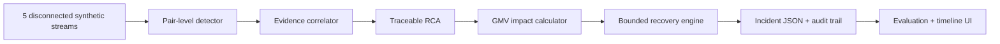

# Payment Incident Investigator + Revenue Recovery Commander

**Razorpay AI Buildathon · Track: AI Revenue Recovery**

Payment incidents rarely live in one tool. A success-rate alert may appear in monitoring, the causal deploy in a release log, a PSP signature in traces, and the revenue exposure only in payment data. This project joins those fragments into the Buildathon loop:

> payment degradation → root cause → recovery action

It continues through quantified business impact, a bounded action, a modeled result, and a complete audit trail. Low-confidence cases are not forced into a narrative: the agent says `unresolved` and escalates.

All events, payment amounts, and evaluation results are synthetic. The **35% recovery success rate is a modeling assumption**, not a measured Razorpay or real-world statistic.

## Architecture



```text
data/simulate.py   60 deterministic incidents: payments, deploys/config,
                   alerts, webhooks, and error traces; 15% ambiguous
src/detector.py    rolling-baseline comparison per (method, route) pair
src/correlator.py  independent evidence scoring with a 0.60 honesty gate
src/rca.py         human-readable RCA using only computed evidence values
src/impact.py      attempted, failed, recoverable, and modeled recovered GMV
src/recovery.py    one primary action, hard bounds, route-health gate, audit
src/pipeline.py    end-to-end record construction and evidence timeline
src/evaluate.py    full-dataset metrics, exceptions, and results.json
ui/timeline.html   no-build incident commander UI
```

## Safety policy

The autonomous decision boundary is code, not prompt text:

- `MIN_CONFIDENCE_FOR_AUTO_ACTION = 0.60`; lower confidence escalates with no autonomous recovery action.
- `MAX_AUTO_RETRY_AMOUNT_INR = 50_000` per payment.
- `MAX_RETRIES_PER_PAYMENT = 2`.
- Route-level incidents require an explicit passing route-health confirmation before retry. Missing confirmation is not treated as healthy.
- Merchant notification requires failed-GMV exposure of at least `INR 100,000` (configurable constant).
- Every action, suppression, and escalation records `{incident_id, action, reason, bounded_by, timestamp}`.

## Run

Python 3.10+ is sufficient; runtime code has no third-party dependencies.

```bash
python3 data/simulate.py
python3 src/evaluate.py
python3 -m unittest discover -s tests -v
```

The evaluator always processes the complete generated dataset and rewrites `results.json`. To present the timeline:

```bash
python3 -m http.server 8000
```

Open `http://localhost:8000/ui/timeline.html`.

## Full-run results

These values come from the checked-in deterministic run of all 60 incidents (51 clear, 9 deliberately ambiguous):

| Metric | Full-dataset result |
|---|---:|
| Pair-level detection accuracy | 98.3% |
| Root-cause accuracy on clear cases | 98.0% |
| Honesty rate on ambiguous cases | 100.0% |
| Attempted GMV | INR 155,581,716 |
| Failed GMV | INR 21,108,516 |
| Recoverable GMV | INR 6,787,322 |
| Modeled recovered amount | INR 2,375,563 |
| Recovery-rate basis | **35% modeling assumption; not measured** |
| Incident escalations | 10 |
| Misdiagnoses | 1 |

Nothing is cherry-picked. `results.json` contains all 60 pipeline records, their evidence and audit trails, plus the complete exception list. The one missed diagnosis is retained: a mild incident's observed rate drop rounded below the explicit detector threshold, so it remained unresolved.

## Sample RCA output

> At 00:00 UTC, UPI Collect failures rose 23.0%. 89.3% came from PSP abc@upi. Merchant deploy overlap: merchant-checkout v8.14.1 at 2026-08-19T23:58:00Z (100% rollout). Razorpay routing config unchanged. Likely merchant deploy regression (confidence 0.95).

> At 00:37 UTC, UPI Intent failures rose 29.0%. 91.2% came from PSP swift@upi. No merchant deploy overlap. Razorpay routing config unchanged. Likely external PSP/bank degradation (confidence 0.85).

> At 03:05 UTC, UPI Intent failures rose 32.0%. 91.9% came from PSP swift@upi. No merchant deploy overlap. Razorpay routing config unchanged. Signals inconclusive - escalating for manual review.

Every percentage, route, timestamp, amount, and confidence value in these strings is derived from the corresponding generated incident record.

## Output contract

Each incident in `results.json` includes detection details, correlation evidence and scoring, RCA text, the four exact GMV fields, the selected recovery action, timeline markers, and the full audit trail. `recovered_amount_inr` is always calculated as `recoverable_gmv_inr × 0.35` and labeled as a modeling assumption everywhere it is displayed.
